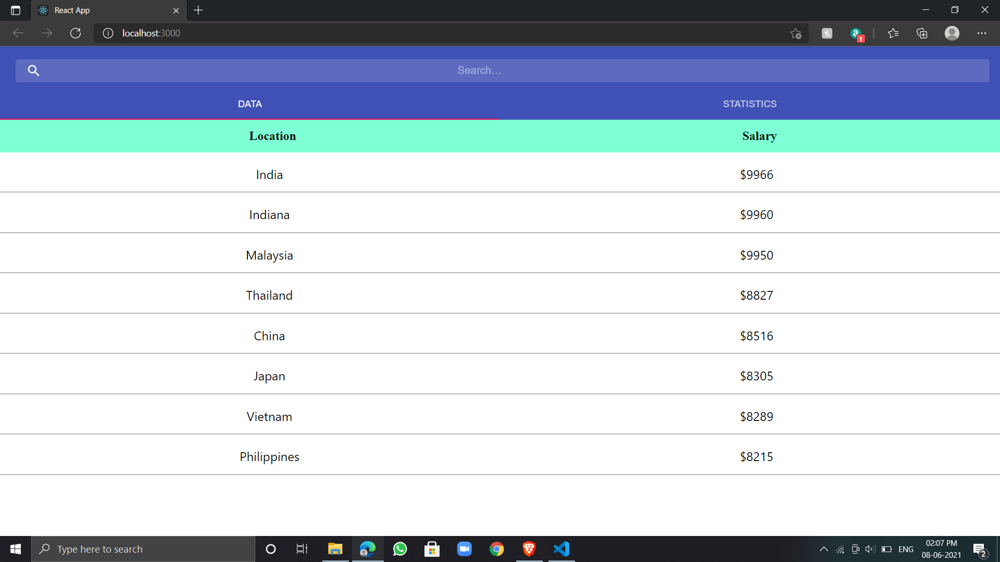
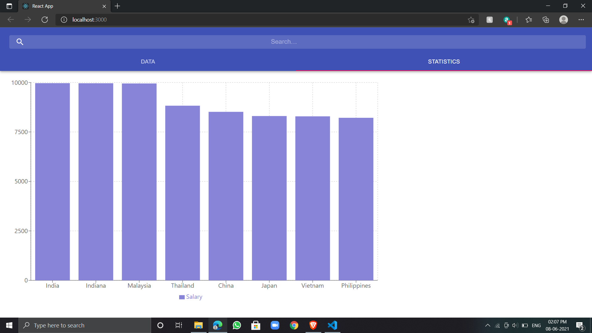
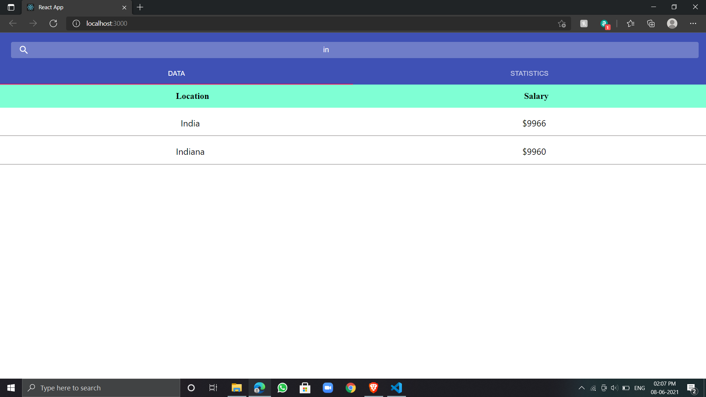
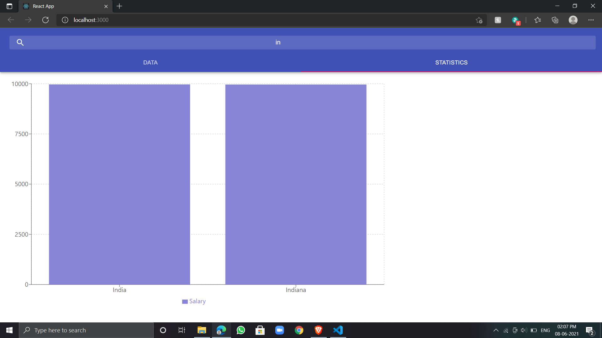

For **run/test** just do **npm start**

**Avg Salary Calculation**
<br><br>
I have calculate the avg_salary of each location in single loop and using two Hash Maps one for location count(no. of employers per location) and second Hash Map for index store of that location in the corresponding index in result array. After each iteration If I found the location then I update the avg_salary of that location by taking data from two maps else I just store the new location in result array and store that index map_index and set map_count of that location as 1
```
var x= emp_data;
var map_index = new Map();    //HashMap for saving location index stored in result array which we already visited.
var map_count = new Map();    ///HashMap for counting the no. of same location.
var result=[];
for (var i=0;i<x.length;i++){
  var currS = parseInt(x[i]['currSalary'].substr(1));
  var loc = x[i]['location'];
  if(!map_count.has(loc)){   //if location is not visited
    map_count.set(loc,1);     //set the current count of location is one since it is occured once.
    map_index.set(loc,result.length);             // storing the location in the map with the index of location stored in final result array.
    result.push({location:loc, Salary:currS });  //once we have count the customer with same location we will add that in the result array.
  }
  else{                                 //location is already stored then we just update the location count and avg_salaray of that location.
    var n =map_count.get(loc);          //get the location count till ith iteration
    var index = map_index.get(loc);     //get the index of that location.
    result[index].Salary = (result[index].Salary*n + currS)/(n+1);    //Update the value of avg_salary of that index location.
    map_count.set(loc,n+1);           // increase the location count by 1;
  }
}
result.sort((a,b)=>{
  return b['Salary']-a['Salary'];   // sort the result array in decreasing order.
})

```

**Simultaneous Search**
<br><br>
We filter that object which has location starts with the searchTerm and same done in bar graph(statistics) and both display changes according to search changes. For more clearity look into code snippet.<br>
For better search result I had added the two more countries India and Indiana so that if serach result in "In" then It gives India and Indiana and represent graph for two only.
```
result.filter((val)=>{
           if(searchTerm === "") {return val;}
           else if(searchTerm != "" && val.location.toLowerCase().startsWith(searchTerm.toLowerCase())) {return val;}
         }).map((data)=>
          {
            return <ul id="inside-ul">
              <li>{data.location}</li>
              <li>${Math.round(data.Salary)}</li>
            </ul>
          })
```
**Screenshots**



